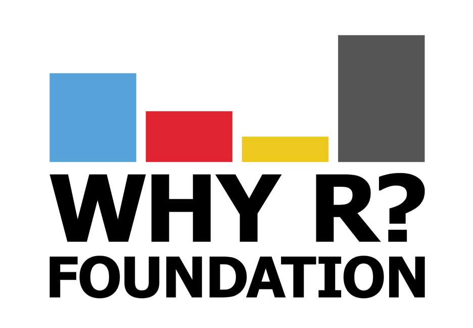

```{r setup, include=FALSE}
htmltools::tagList(rmarkdown::html_dependency_font_awesome())
knitr::opts_chunk$set(echo = TRUE)
```

<center>

[[Foundation]](http://whyr.pl/foundation/) &nbsp;&nbsp; [[2017 Conference]](https://whyr2017.github.io/) &nbsp;&nbsp; [[2018 Conference]](http://whyr2018.pl/) &nbsp;&nbsp; [[2019 Conference]](http://whyr.pl/2019/)
<br><br>
[[2017 After Movie]](https://vimeo.com/239259242) &nbsp;&nbsp; [[2017 Photos]](https://www.facebook.com/whyRconf/photos/) &nbsp;&nbsp; [[2017 Presentations]](https://github.com/WhyR2017/prezentacje)

2018 After Movie &nbsp;&nbsp; [[2018 Photos]](https://www.facebook.com/whyRconf/photos/) &nbsp;&nbsp; [[2018 Presentations]](https://github.com/WhyR2018/presentations)

```{r, echo=FALSE, results='asis'}
# knitr::kable(data.frame(nazwa = c("Hackathon", "Warsztaty", "Konferencja"),
#                         spacja = c(" -- ", " -- ", " -- "),
#                         data = c("26.09.2017", "27.09.2017", "27-28.09.2017")),
#              format = "html", col.names = NULL, align = c("l", "c", "r"))
```


</center>